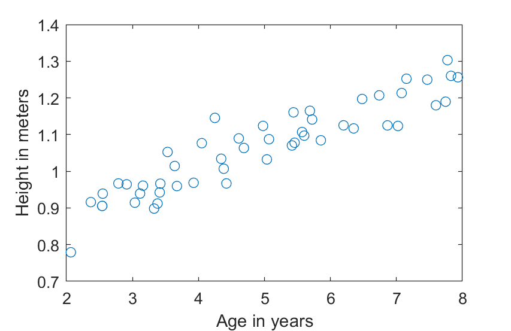
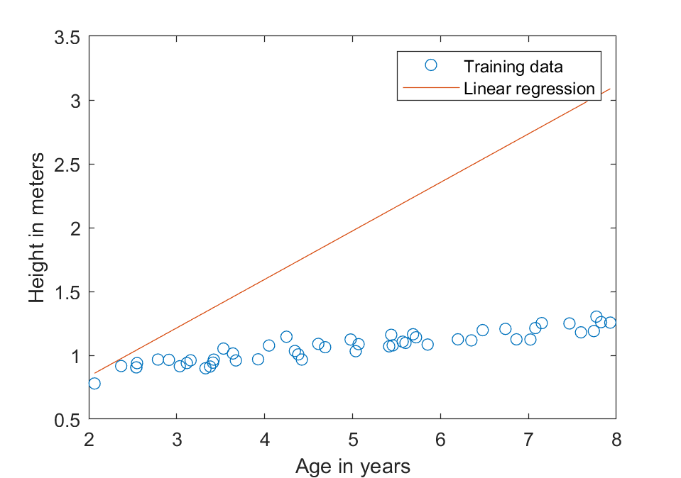
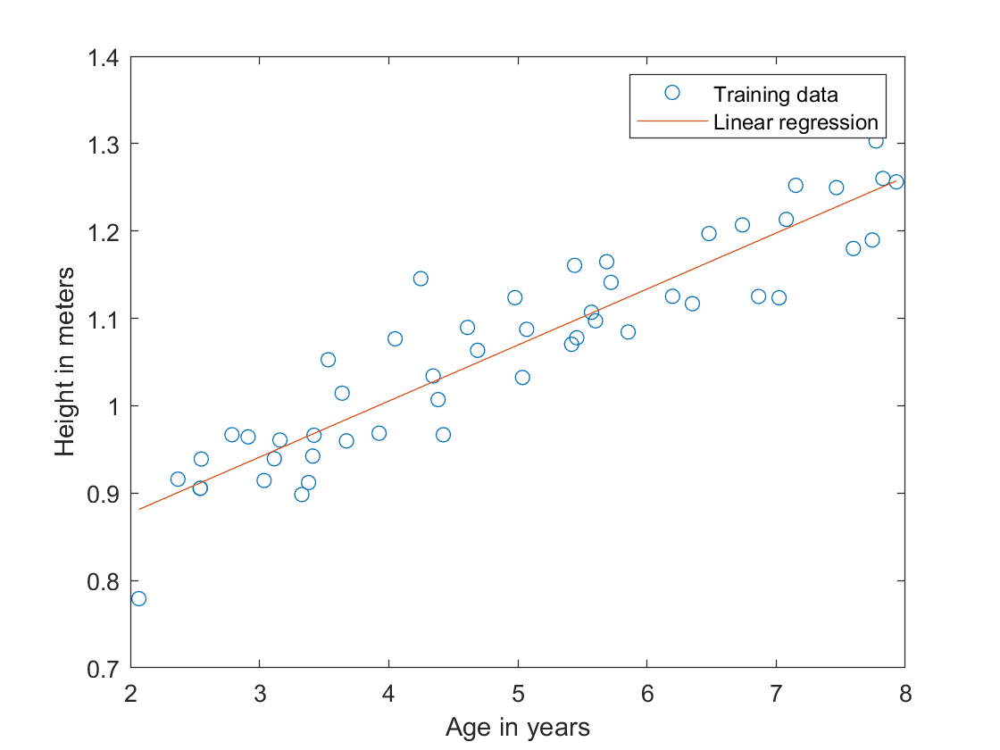
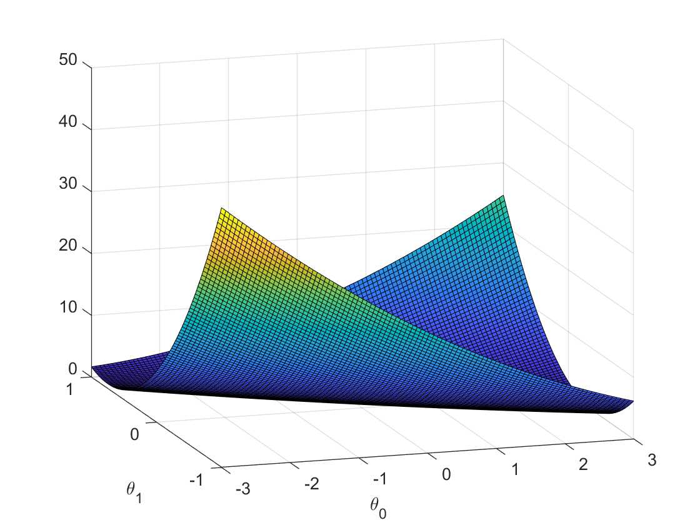
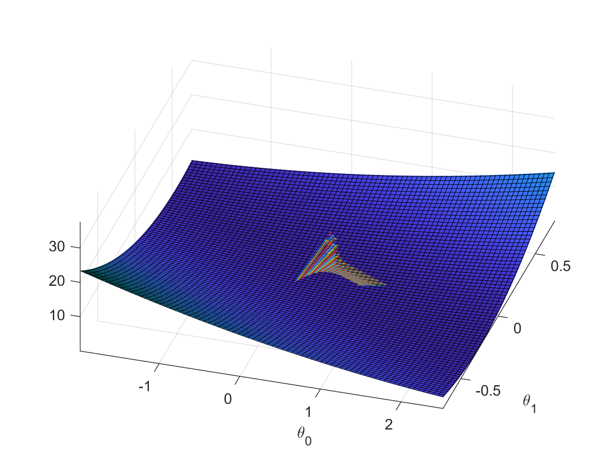

# 实验一

* 苏博南 202000460020

## Data plot

载入数据后，可以发现`x`、`y`均为长度为50的列向量。

```matlab
>>size(y)
ans =
    50     1
```

利用`plot`函数，可以作出`y`和`x`的散点图：



绘制代码为：

```matlab
x = load("ex1Data/ex1x.dat");
y = load("ex1Data/ex1y.dat");

plot(x, y, 'o');
ylabel("Height in meters");
xlabel("Age in years");
```

## 2D Linear Regression

### 实验原理

根据线性回归模型，最后的回归曲线方程为$\hat{y}=kx+b$。在通过向`x`向量添加一列全为1的列向量后：

```matlab
x = [ones(m, 1), x];
```

回归模型变为：$\hat{y}=x\theta$。其中，$size(\theta)=2\times1$。

利用最小二乘法可估计损失函数为：
$$
Loss(\theta)=\frac{1}{2m}\sum_{i=1}^m(\hat{y}_i-y_i)^2=\frac{1}{2m}\sum_{i=1}^m(x_i\theta-y_i)^2
$$
其中，$x_i$对应指导书上的$x^{(i)}$（为和matlab统一选择下标），为一个$1\times 2$的行向量。通过梯度算子，有：
$$
\nabla\times Loss=(\frac{\partial Loss}{\partial\theta_1},\frac{\partial Loss}{\partial\theta_2})
$$
其中，
$$
\frac{\partial Loss}{\partial\theta_j}=\frac{1}{m}\sum_{i=1}^m(\hat{y}_i-y_i)x_{i,j}
$$
通过选择**学习步长**$\alpha=0.07$，可以得到如下梯度下降迭代算法：
$$
\overrightarrow{\theta}:=\overrightarrow{\theta}-\alpha\nabla\times Loss\\
\Rightarrow
\theta_j:=\theta_j-\frac{\alpha}{m}\sum_{i=1}^m(x_i\theta-y_i)x_{i,j},\quad j=1,2
$$
故可以得到梯度下降学习算法的matlab代码：

```matlab
m = length(y);
x = [ones(m, 1), x];

alpha = 0.07;
theta = [0; 0];
numIt = 0;
while 1 > 0
    newTheta = zeros(2, 1);
    h = x * theta;
    for j = 1 : 2
        sum = 0;
        for i = 1 : m
            sum = sum + (h(i) - y(i)) * x(i, j);
        end
        newTheta(j) = theta(j) - alpha / m * sum;
    end
    if max(abs(newTheta - theta)) < 0.00001
        break;
    end
    theta = newTheta;
    numIt = numIt + 1;
    if mod(numIt, 100) == 0
        numIt
    end
end

hold on;
plot(x(:, 2), x * theta, '-');

legend( 'Training data' , 'Linear regression');
```

其中，选择初始值$\theta_0=(0,0)^T$，每100次迭代打印一次`numIt`。当$\theta$的变化值小于$10^{-5}$次方时，认为迭代收敛。此时有：
$$
\nabla\times Loss(\theta^*)=\textbf{0}
$$
认为得到了一个使得损失函数局部最小的参数$\theta^*$。

### 实验结果

在一次迭代后，得到的$\theta$值为

```matlab
>>theta
theta =
    0.0745
    0.3800
```

此时，回归直线为：



若设置$\theta$变化幅度不大于$10^{-5}$则认为收敛，那么经过855次迭代后，得到的$\theta$值为：

```matlab
>>theta =
    0.7488
    0.0641
```

此时，回归直线为：



可以看出，训练集数据点近似地分布在回归直线周围。

## Understanding $J(\theta)$

为进一步研究损失函数和$\theta$的关系，我们将作出$J(\theta)$图像。即首先网格化$(\theta_0,\theta_1)$，然后根据定义作图。绘图代码如下：

```matlab
x = load("ex1Data/ex1x.dat");
y = load("ex1Data/ex1y.dat");

m = length(y);
x = [ones(m, 1), x];

J_vals = zeros(100, 100);
theta0_vals = linspace(-3, 3, 100);
theta1_vals = linspace(-1, 1, 100);
for i = 1 : length(theta0_vals)
    for j = 1 : length(theta1_vals)
        theta = [theta0_vals(i); theta1_vals(j)];
        sum = 0;
        for t = 1 : m
            sum = sum + (x(t, :) * theta - y(t))^2;
        end
        J_vals(i, j) = sum / (2 * m);
    end
end

J_vals = J_vals';
surf(theta0_vals, theta1_vals, J_vals);
hold on;
xlabel("\theta_0");
ylabel("\theta_1");

thetas = load("thetas.txt");
for i = 1 : size(thetas, 1) - 1
    a = [thetas(i, 1), thetas(i, 2)];
    sum = 0;
    for t = 1 : m
        sum = sum + (x(t, :) * a' - y(t))^2;
    end
    a = [a, sum / (2 * m)];

    b = [thetas(i + 1, 1), thetas(i + 1, 2)];
    sum = 0;
    for t = 1 : m
        sum = sum + (x(t, :) * b' - y(t))^2;
    end
    b = [b, sum / (2 * m)];
    quiver3(a(1), a(2), a(3), b(1), b(2), b(3));
end

```

作出的图像图下：



可以发现是一个平滑的、局部极小值即为全局最小值的一个函数图像。而且我们选择的初始值$(0,0)$已经非常接近最优解。

然后我想了下可以画一下迭代的过程，即“沿着梯度下降”的过程，作出来如下图：



可以看到参数值在$[0,1]\times [0,1]$的方格内逡巡而不敢向前，徘徊踌躇彳亍若干次后，逐渐收敛。（￣▽￣）