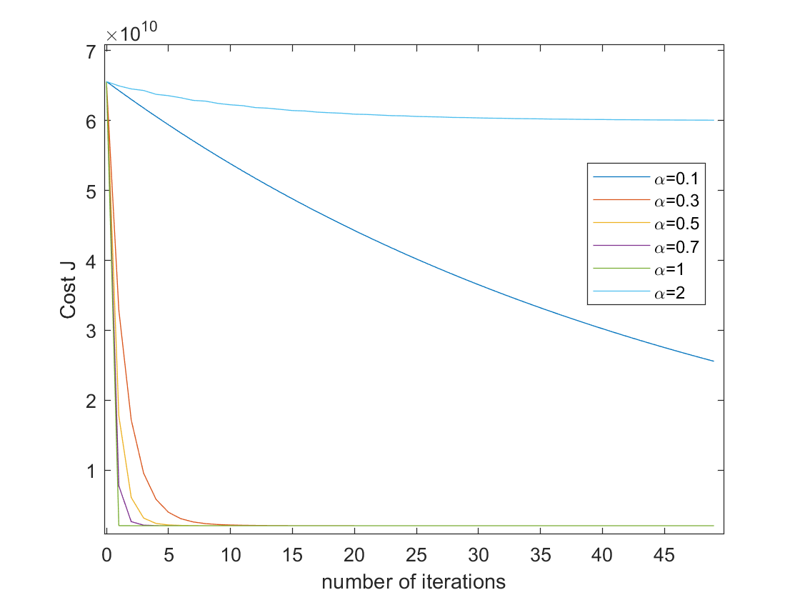

# 实验二

* 苏博南202000460020

## Selecting A Learning Rate Using $J(\theta)$

考虑选择学习率$\alpha=0.01,0.3,0.5,0.7,1,2$，分别进行梯度下降法，matlab代码如下：

```matlab
X = load("ex2Data/ex2x.dat");
Y = load("ex2Data/ex2y.dat");
[m, n] = size(X);
X = [ones(m, 1), X];
sigma = std(X);
mu = mean(X);
X(:, 2) = (X(:, 2) - mu(2)) ./ sigma(2);
X(:, 3) = (X(:, 3) - mu(3)) ./ sigma(3);

learning_range = [0.001, 10];

alpha = [0.01, 0.3, 0.5, 0.7, 1, 2];

J = zeros(50, 6);
for t = 1 : 6
    theta = [0, 0, 0]';
    for num_iterations = 1 : 50
        J(num_iterations, t) = 1 / (2 * m) * sum((X * theta - Y) .* (X * theta - Y));

        for j = 1 : length(theta)
            sums = 0;
            for i = 1 : size(X, 1)
                sums = sums + (X(i, :) * theta - Y(i)) * X(i, j);
            end
            theta(j) = theta(j) - alpha(t) / m * sums;
        end
    end
end

figure ;
plot (0 : 49 , J(1 : 50, 1), '-' );
hold on;
plot (0 : 49 , J(1 : 50, 2), '-' );
plot (0 : 49 , J(1 : 50, 3), '-' );
plot (0 : 49 , J(1 : 50, 4), '-' );
plot (0 : 49 , J(1 : 50, 5), '-' );
plot (0 : 49 , J(1 : 50, 6), '-' );
legend("\alpha=0.1","\alpha=0.3","\alpha=0.5","\alpha=0.7","\alpha=1","\alpha=2");
xlabel("number of iterations");
ylabel("Cost J");
```

最终得到的结果为：



可以看到，当学习率较低时$\alpha=0.1$，损失函数下降较慢；但当学习率太高时$\alpha=2$，损失函数也会发生几乎不下降的情况。如果取$\alpha=5$，那么损失函数会直接发散到$10^{65}$级别无法在图中作出。这也是因为学习率太高导致了损失函数发散，或一直在zig-zaging导致收敛很慢。

最终选择了图示最佳学习率$\alpha=1$，直接一步到位。迭代最终的$\theta$为：

```matlab
theta =

   1.0e+05 *

    3.4041
    1.1063
   -0.0665
```

然后预测1650 square feets 3 bedrooms的房价时，需要进行feature scaling：

```matlab
>>>pre_X = [1, 1650, 3];
>>>pre_X(2) = (pre_X(2) - mu(2)) / sigma(2);
>>>pre_X(3) = (pre_X(3) - mu(3)) / sigma(3);
>>>pre_X * theta

ans =

   2.9308e+05
```

最终预测结果为29308美元。

## Normal Equation

利用Normal equation进行$\theta^*$和预测值的计算代码如下：

```matlab
X = load("ex2Data/ex2x.dat");
Y = load("ex2Data/ex2y.dat");
[m, n] = size(X);
X = [ones(m, 1), X];

theta = inv(X' * X) * X' * Y

[1, 1650, 3] * theta
```

得到的结果为：

```matlab

theta =

   1.0e+04 *

    8.9598
    0.0139
   -0.8738


ans =

   2.9308e+05

```

可以看到预测结果也为29308美元。